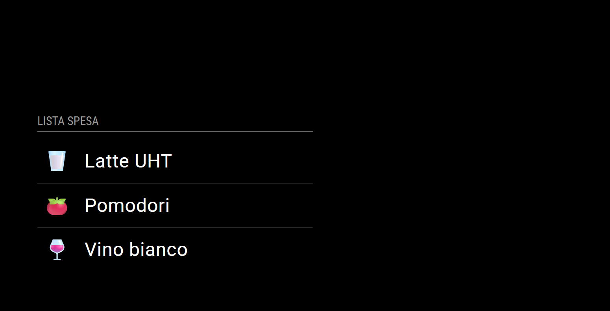

# MMM-KitchenOwl

A premium module for [MagicMirror²](https://github.com/MagicMirrorOrg/MagicMirror) that seamlessly integrates your shopping list from a self-hosted [KitchenOwl](https://kitchenowl.org/) instance.

This module is specifically engineered to work with the **modern Flutter versions of KitchenOwl (2025+)**. Unlike older integrations, it utilizes **Long Lived Tokens** to ensure a stable, secure, and persistent connection without the need for daily re-authentication. Whether you are planning dinner or running out of essentials, this module keeps your household synchronized in real-time.



## Features
* 🛒 **Real-time Synchronization:** Instantly displays items from your household shopping list.
* 🔐 **Persistent Connection:** Uses Long Lived Tokens for a "set it and forget it" experience (no expiring session cookies!).
* 🎨 **Smart Emojis:** Automatically detects item names (e.g., "Milk", "Bread", "Tomato") and assigns the corresponding emoji 🥛 🍞 🍅 for a beautiful visual experience.
* 📱 **Mobile-First Design:** Styled to look like a clean, modern mobile app widget directly on your mirror.

## Prerequisites
* An active instance of MagicMirror².
* A self-hosted instance of KitchenOwl running on your network.

## Installation

1.  Navigate to your MagicMirror `modules` folder:
    ```bash
    cd ~/MagicMirror/modules
    ```
2.  Clone this repository:
    ```bash
    git clone https://github.com/4rc/MMM-KitchenOwl.git
    ```
3.  Install dependencies:
    ```bash
    cd MMM-KitchenOwl
    npm install
    ```

## Configuration

Add this entry to your `config/config.js` file:

```javascript
{
    module: "MMM-KitchenOwl",
    position: "bottom_left",
    header: "Shopping List",
    config: {
        // Your KitchenOwl internal URL (e.g., http://192.168.1.50:8383)
        apiUrl: "http://YOUR_NAS_IP:PORT",
        
        // Generate this in KitchenOwl App: Profile -> Sessions -> Bottom of page
        apiKey: "YOUR_LONG_LIVED_TOKEN_HERE",
        
        // Update interval in milliseconds (default: 1 minute)
        updateInterval: 60 * 1000,
        
        // Show checked items? (true/false)
        showCompleted: false
    }
},
```

## How to get the Long Lived Token
To ensure the module stays connected forever, you need a specific token type:

1. Open your **KitchenOwl App** (or Web Interface).
2. Tap on your **Profile Icon** (Avatar) to open settings.
3. Scroll down to the **Sessions** section.
4. Look at the very bottom for **Long Lived Tokens**.
5. Click **+**, give it a name (e.g., "MagicMirror"), and copy the long string.
6. Paste it into the `apiKey` field in your config.

## Customizing Emojis
You can easily customize or translate the icon mapping to your language. 
Simply edit the `MMM-KitchenOwl.js` file and modify the `getIcon` function to add your favorite foods!

## License
MIT
